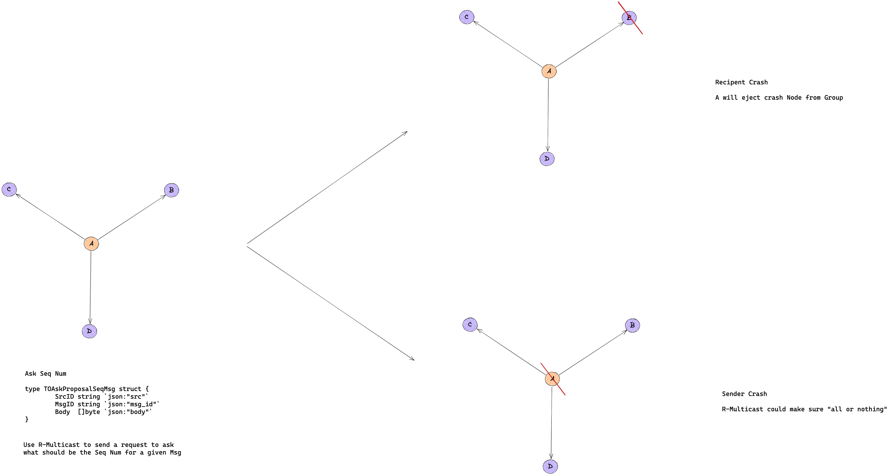
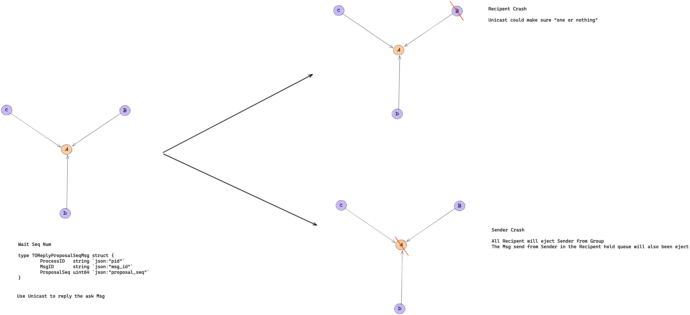
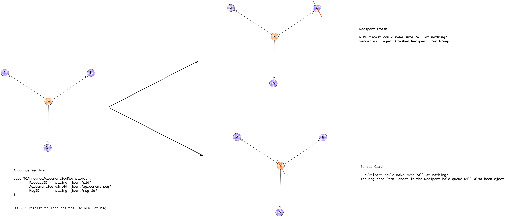

# MP1

## Build and Run

```bash
# Quick Build
bash ./script/unix/mp1/quick_build.bash
# Release Build
bash ./script/unix/mp1/build.bash
# Usage

# 1 nodes for local test
./bin/mp1 A 8080 ./lib/mp1/config/1/config_a.txt

# 2 nodes for local test
./bin/mp1 A 8080 ./lib/mp1/config/2/config_a.txt
./bin/mp1 B 8081 ./lib/mp1/config/2/config_b.txt

# 3 nodes
./bin/mp1 A 8080 ./lib/mp1/config/config_a.txt
./bin/mp1 B 8081 ./lib/mp1/config/config_b.txt
./bin/mp1 C 8082 ./lib/mp1/config/config_c.txt

# just stdout
python3 -u ./script/unix/mp1/gentx.py 0.5 | ./bin/mp1 A 8080 ./lib/mp1/config/3/config_a.txt 2> /dev/null
python3 -u ./script/unix/mp1/gentx.py 0.5 | ./bin/mp1 B 8081 ./lib/mp1/config/3/config_b.txt 2> /dev/null
python3 -u ./script/unix/mp1/gentx.py 0.5 | ./bin/mp1 C 8082 ./lib/mp1/config/3/config_c.txt 2> /dev/null

# stderr to file
python3 -u ./script/unix/mp1/gentx.py 0.5 | ./bin/mp1 A 8080 ./lib/mp1/config/3/config_a.txt 2> /tmp/a.log
python3 -u ./script/unix/mp1/gentx.py 0.5 | ./bin/mp1 B 8081 ./lib/mp1/config/3/config_b.txt 2> /tmp/b.log
python3 -u ./script/unix/mp1/gentx.py 0.5 | ./bin/mp1 C 8082 ./lib/mp1/config/3/config_c.txt 2> /tmp/c.log

# json log
python3 -u ./script/unix/mp1/gentx.py 0.5 | LOG=json ./bin/mp1 A 8080 ./lib/mp1/config/3/config_a.txt 2> /tmp/a.log
python3 -u ./script/unix/mp1/gentx.py 0.5 | LOG=json ./bin/mp1 B 8081 ./lib/mp1/config/3/config_b.txt 2> /tmp/b.log
python3 -u ./script/unix/mp1/gentx.py 0.5 | LOG=json ./bin/mp1 C 8082 ./lib/mp1/config/3/config_c.txt 2> /tmp/c.log

# trace log
python3 -u ./script/unix/mp1/gentx.py 0.5 | LOG=trace ./bin/mp1 A 8080 ./lib/mp1/config/3/config_a.txt 2> /tmp/a.log
python3 -u ./script/unix/mp1/gentx.py 0.5 | LOG=trace ./bin/mp1 B 8081 ./lib/mp1/config/3/config_b.txt 2> /tmp/b.log
python3 -u ./script/unix/mp1/gentx.py 0.5 | LOG=trace ./bin/mp1 C 8082 ./lib/mp1/config/3/config_c.txt 2> /tmp/c.log
```

## System Architecture

We use a combination of ISIS algorithm and R-Multicast to ensure reliable Total-Ording.
Among them, the ISIS algorithm can guarantee Total-Ording, R-Multicast to ensure reliable Multicast.
In addition, we also assume that once a node loses its TCP connection, it will be evicted from the Group.





### ISIS

[ISIS](https://studylib.net/doc/7830646/isis-algorithm-for-total-ordering-of-messages)


### Node

Each Node is an independent individual that exists in the Group;
This Node and other Nodes perform full-duplex TCP communication according to the configuration in the configuration file.
Each Node has a unique Node ID in the Group to indicate the identity of the process.

### Group

Group is a collection of Node. Group encapsulates `Unicast`, `B-Multicast`, `R-Multicast` and `TO-Multicast`.

### Config

Parse the configuration file

### Dispatcher

A simple Router implementation.

### Metrics

Record bandwidth and latency

### Transaction

-The logical realization of the transaction
-Analyze transactions
-Register transaction processing function

### Retry

-Retry regularly

## Verbose Mode

```bash
LOG=trace
```

## JSON Mode

```bash
LOG=json
```

## Command Line Arguments

Each node must take three arguments. The first argument is an identifier that is unique for each node. The second argument is the port number it listens on. The third argument is a configuration file – the first line of the configuration file is the number of other nodes in the system that it must connect to, and each subsequent line contains the identifier, hostname, and the port no. of these nodes. Note the configuration file provided to each node will be different (as it will exclude the identifier, hostname and port of that node). For example, consider a system of three nodes with identifiers node1, node2 and node3, where a node runs on each of the first 3 VMs in your group (say g01), and each node uses port no. 1234. The configuration file provided to node1 should look like this:

```txt
2
node2 fa21-cs425-g01-02.cs.illinois.edu 1234
node3 fa21-cs425-g01-03.cs.illinois.edu 1234
```

The configuration file for the second node will look like this:

```txt
2
node1 fa21-cs425-g01-01.cs.illinois.edu 1234
node3 fa21-cs425-g01-03.cs.illinois.edu 1234
```

And so on. We will use our own configuration files when testing the code, so make sure your configuration file complies with this format.

Each node must listen for TCP connections from other nodes, as well as initiate a TCP connection to each of the other nodes. Note that a connection initiation attempt will fail, unless the other node’s listening socket is ready. Your node’s implementation may continuously try to initiate connections until successful. You may assume no node failure occurs during this start-up phase. Further ensure that your implementation appropriately waits for a connection to be successfully established before trying to send on it.

Note: make sure your node can run using the EXACT command given below.

```bash
./mp1_node {node id} {port} {config file}
```
