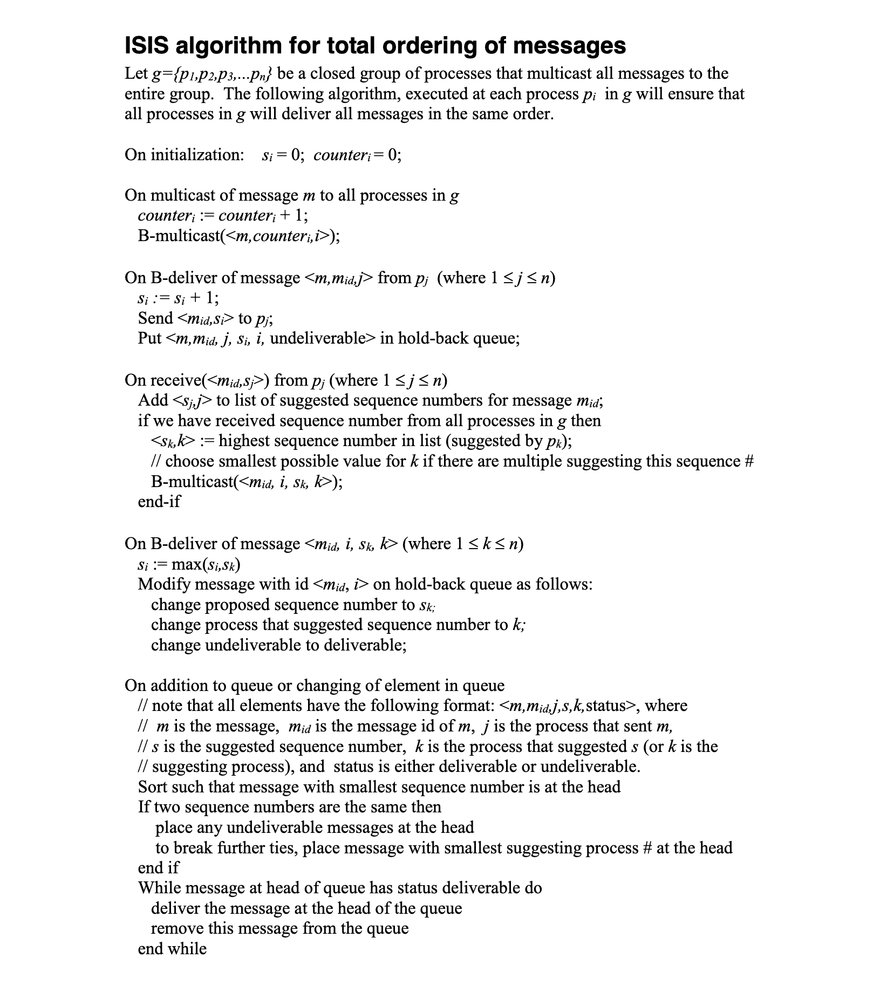

# MP1

## Build and Run

```bash
# Quick Build
bash ./script/unix/mp1/quick_build.bash
# Release Build
bash ./script/unix/mp1/build.bash
# Usage

# 1 nodes for local test
./bin/mp1 A 8080 ./lib/mp1/config/1/config_a.txt

# 2 nodes for local test
./bin/mp1 A 8080 ./lib/mp1/config/2/config_a.txt
./bin/mp1 B 8081 ./lib/mp1/config/2/config_b.txt

# 3 nodes
./bin/mp1 A 8080 ./lib/mp1/config/config_a.txt
./bin/mp1 B 8081 ./lib/mp1/config/config_b.txt
./bin/mp1 C 8082 ./lib/mp1/config/config_c.txt

# just stdout
python3 -u ./script/unix/mp1/gentx.py 0.5 | ./bin/mp1 A 8080 ./lib/mp1/config/3/config_a.txt 2> /dev/null
python3 -u ./script/unix/mp1/gentx.py 0.5 | ./bin/mp1 B 8081 ./lib/mp1/config/3/config_b.txt 2> /dev/null
python3 -u ./script/unix/mp1/gentx.py 0.5 | ./bin/mp1 C 8082 ./lib/mp1/config/3/config_c.txt 2> /dev/null

# stderr to file
python3 -u ./script/unix/mp1/gentx.py 0.5 | ./bin/mp1 A 8080 ./lib/mp1/config/3/config_a.txt 2> /tmp/a.log
python3 -u ./script/unix/mp1/gentx.py 0.5 | ./bin/mp1 B 8081 ./lib/mp1/config/3/config_b.txt 2> /tmp/b.log
python3 -u ./script/unix/mp1/gentx.py 0.5 | ./bin/mp1 C 8082 ./lib/mp1/config/3/config_c.txt 2> /tmp/c.log

# json log
python3 -u ./script/unix/mp1/gentx.py 0.5 | LOG=json ./bin/mp1 A 8080 ./lib/mp1/config/3/config_a.txt 2> /tmp/a.log
python3 -u ./script/unix/mp1/gentx.py 0.5 | LOG=json ./bin/mp1 B 8081 ./lib/mp1/config/3/config_b.txt 2> /tmp/b.log
python3 -u ./script/unix/mp1/gentx.py 0.5 | LOG=json ./bin/mp1 C 8082 ./lib/mp1/config/3/config_c.txt 2> /tmp/c.log

# trace log
python3 -u ./script/unix/mp1/gentx.py 0.5 | LOG=trace ./bin/mp1 A 8080 ./lib/mp1/config/3/config_a.txt 2> /tmp/a.log
python3 -u ./script/unix/mp1/gentx.py 0.5 | LOG=trace ./bin/mp1 B 8081 ./lib/mp1/config/3/config_b.txt 2> /tmp/b.log
python3 -u ./script/unix/mp1/gentx.py 0.5 | LOG=trace ./bin/mp1 C 8082 ./lib/mp1/config/3/config_c.txt 2> /tmp/c.log
```

## System Architecture

### ISIS

[ISIS](https://studylib.net/doc/7830646/isis-algorithm-for-total-ordering-of-messages)


### A

All processes in the total order multicast algorithm are identical;
there is no leader process and there is no order in which processes need to be brought up.
Each process remains operational once started, even if there are no more messages to multicast.

## Verbose Mode

```bash
LOG=trace
```

## JSON Mode

```bash
LOG=json
```

## Command Line Arguments

```bash

```
